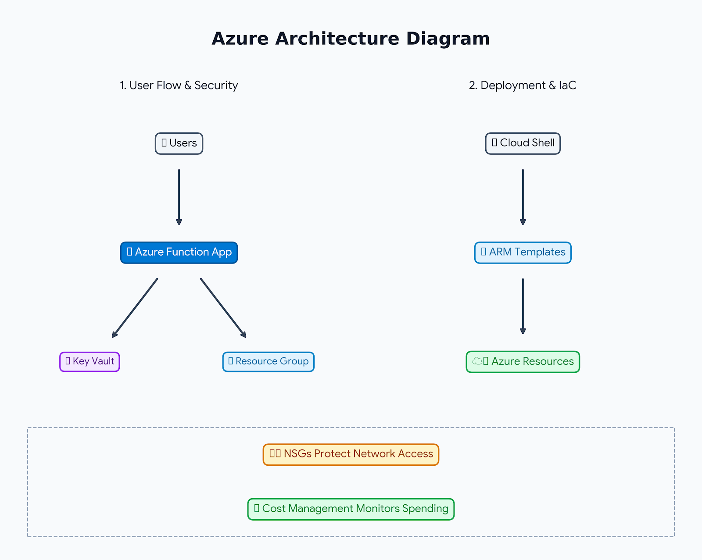

# Azure Secure Cloud Foundation

## Overview

This project demonstrates the implementation of a secure, scalable, and cost-aware cloud foundation using Microsoft Azure.

The solution incorporates Infrastructure as Code (IaC), serverless computing, cloud administration, network security, encryption management, and cost governance practices commonly used in enterprise cloud environments.

Throughout the project, Azure-native services were deployed, configured, validated, and documented to demonstrate practical cloud engineering and Azure administration skills.

---

## Business Scenario

Organizations migrating workloads to the cloud require a secure and repeatable foundation that supports automation, workload scalability, data protection, operational management, and financial governance.

This project demonstrates how Azure services can be combined to support:

- Infrastructure automation
- Event-driven processing
- Network security enforcement
- Encryption and data protection
- Cloud administration
- Cost monitoring and governance

---

## Solution Architecture



The platform consists of six core components:

1. Event-Driven Processing
2. Infrastructure as Code
3. Cloud Infrastructure Administration
4. Network Security Controls
5. Secrets and Encryption Management
6. Cloud Cost Governance

---

# Project Achievements

✅ Implemented serverless event-driven processing using Azure Functions and Azure Queue Storage

✅ Exported and deployed Infrastructure as Code using Azure Resource Manager (ARM) Templates

✅ Provisioned and validated Azure networking resources using Cloud Shell, PowerShell, and Azure CLI

✅ Implemented subnet-level security controls using Azure Network Security Groups

✅ Configured customer-managed encryption using Azure Key Vault

✅ Established cost governance through budgets and automated spending alerts

---

# Project Components

## 1. Event-Driven Processing with Azure Functions

Implemented a serverless processing solution using Azure Functions and Azure Queue Storage.

### Highlights

- Deployed Azure Function App
- Configured Azure Queue Storage integration
- Tested queue-triggered processing
- Configured output bindings
- Validated function execution workflows

### Technologies

- Azure Functions
- Azure Queue Storage
- Serverless Computing
- Event-Driven Architecture

### Documentation

```text
serverless/azure-functions.md
```

---

## 2. Infrastructure as Code with ARM Templates

Implemented Infrastructure as Code practices using Azure Resource Manager templates.

### Highlights

- Exported custom ARM templates from Azure resources
- Reviewed ARM template structure and configuration
- Deployed Azure Virtual Machine using ARM templates
- Explored Azure Resource Manager APIs using Azure Resource Explorer

### Technologies

- Azure Resource Manager
- ARM Templates
- Azure Resource Explorer
- Infrastructure as Code

### Documentation

```text
infrastructure/deployment-guide.md
```

---

## 3. Cloud Infrastructure Administration

Configured Azure Cloud Shell and managed Azure infrastructure through command-line tools.

### Highlights

- Configured Azure Cloud Shell
- Deployed Azure Virtual Network (VNet)
- Verified resources using Azure PowerShell
- Managed resources using Azure CLI

### Technologies

- Azure Cloud Shell
- Azure PowerShell
- Azure CLI
- Azure Networking

### Documentation

```text
automation/cloud-shell-commands.md
```

---

## 4. Network Security Controls

Implemented network access control and traffic filtering using Azure Network Security Groups.

### Highlights

- Created Azure Network Security Group (NSG)
- Associated NSG with an Azure subnet
- Configured custom inbound and outbound rules
- Applied network traffic filtering policies

### Technologies

- Azure Networking
- Network Security Groups (NSGs)
- Access Control
- Security Governance

### Documentation

```text
security/network-security-groups.md
```

---

## 5. Secrets and Encryption Management

Implemented centralized encryption and key management using Azure Key Vault.

### Highlights

- Created and configured Azure Key Vault
- Created customer-managed encryption keys
- Configured Azure Storage Account encryption
- Implemented centralized key management

### Technologies

- Azure Key Vault
- Customer Managed Keys (CMKs)
- Azure Storage Accounts
- Data Encryption

### Documentation

```text
security/key-vault.md
```

---

## 6. Cloud Cost Governance

Implemented financial monitoring and budget controls using Azure Cost Management.

### Highlights

- Reviewed Azure subscription configuration
- Explored Azure Cost Management capabilities
- Created budget monitoring controls
- Configured automated spending alerts

### Technologies

- Azure Cost Management
- Budget Monitoring
- FinOps Fundamentals
- Cloud Governance

### Documentation

```text
governance/cost-management.md
```

---

# Technologies Used

## Cloud Platform

- Microsoft Azure

## Compute

- Azure Functions

## Storage

- Azure Queue Storage
- Azure Storage Accounts

## Infrastructure as Code

- Azure Resource Manager (ARM)
- ARM Templates

## Networking

- Azure Virtual Networks (VNets)
- Network Security Groups (NSGs)

## Security

- Azure Key Vault
- Customer Managed Keys (CMKs)

## Administration

- Azure Cloud Shell
- Azure PowerShell
- Azure CLI

## Governance

- Azure Cost Management

---

# Skills Demonstrated

### Cloud Engineering

- Cloud Infrastructure Deployment
- Cloud Operations
- Resource Administration
- Azure Service Management

### Infrastructure as Code

- ARM Templates
- Automated Provisioning
- Resource Deployment Automation

### Serverless Computing

- Azure Functions
- Azure Queue Storage
- Event-Driven Architecture

### Security

- Azure Key Vault
- Network Security Groups
- Customer Managed Encryption
- Cloud Security Controls

### Networking

- Virtual Networks
- Subnet Security
- Traffic Filtering
- Network Access Control

### Financial Governance

- Cost Management
- Budget Planning
- Cost Monitoring
- FinOps Fundamentals

---

# Repository Structure

```text
azure-secure-cloud-foundation/
│
├── README.md
│
├── architecture/
│   ├── architecture-diagram.png
│   └── solution-overview.md
│
├── infrastructure/
│   ├── arm-templates/
│   └── deployment-guide.md
│
├── serverless/
│   └── azure-functions.md
│
├── security/
│   ├── key-vault.md
│   └── network-security-groups.md
│
├── automation/
│   └── cloud-shell-commands.md
│
├── governance/
│   └── cost-management.md
│
├── screenshots/
│
└── docs/
    ├── project-scope.md
    ├── implementation.md
    └── lessons-learned.md
```

---

# Key Outcomes

- Successfully implemented a serverless event-processing workflow using Azure Functions and Azure Queue Storage.
- Automated infrastructure deployment through ARM Templates.
- Managed Azure resources using Cloud Shell, PowerShell, and Azure CLI.
- Applied network security controls using Azure Network Security Groups.
- Implemented customer-managed encryption through Azure Key Vault.
- Established cloud cost governance using Azure Cost Management budgets and alerts.

---

# Future Enhancements

Potential future improvements include:

- Deploying infrastructure with Bicep
- Terraform-based provisioning
- Azure Monitor integration
- Azure Policy implementation
- Role-Based Access Control (RBAC)
- GitHub Actions CI/CD pipelines
- Log Analytics and monitoring dashboards

---

## Author

**Rostyslav Pron**

Azure Cloud Engineering Portfolio Project
