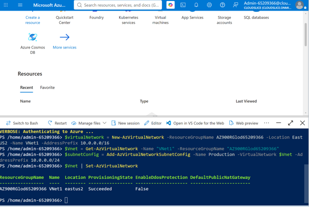

# Cloud Infrastructure Administration with Azure Cloud Shell

## Project Overview

This component of the platform demonstrates the deployment and administration of Azure infrastructure using Azure Cloud Shell. The implementation focused on configuring a cloud-based management environment, deploying network infrastructure, validating resources with Azure PowerShell, and managing resources through Azure CLI.

By using command-line administration tools, infrastructure can be deployed and maintained efficiently while reducing reliance on manual portal-based configuration.

---

# Business Scenario

Cloud administrators require secure and consistent methods for managing infrastructure resources across environments. Browser-based administration tools provide flexibility while supporting automation and operational efficiency.

Azure Cloud Shell enables administrators to:

- Provision cloud resources through command-line tools
- Manage infrastructure remotely
- Validate resource deployments
- Execute automation workflows
- Access Azure PowerShell and Azure CLI from a centralized environment

To support these requirements, Azure Cloud Shell was configured and used to deploy and validate Azure networking resources.

---

# Objectives

- Configure Azure Cloud Shell
- Deploy Azure Virtual Network (VNet) resources
- Validate resource deployment using Azure PowerShell
- Manage cloud resources using Azure CLI 2.0
- Demonstrate command-line based cloud administration

---

# Solution Components

## Azure Cloud Shell

Azure Cloud Shell was configured as the primary administration environment for the project.

### Purpose

- Provide browser-based cloud administration
- Enable Azure PowerShell access
- Enable Azure CLI access
- Support infrastructure deployment and management

### Benefits

- No local software installation required
- Built-in Azure authentication
- Consistent administration environment
- Remote accessibility

---

## Azure Virtual Network (VNet)

A Virtual Network was deployed to provide the foundational network layer for Azure resources.

### Purpose

- Establish logical network boundaries
- Enable communication between resources
- Support future cloud workload deployments

### Benefits

- Network isolation
- Improved resource organization
- Scalable cloud architecture

---

## Azure PowerShell

Azure PowerShell was used to verify deployed resources and review network configurations.

### Purpose

- Validate infrastructure deployment
- Query resource properties
- Confirm operational status

### Benefits

- Scripted administration
- Improved visibility into resource configurations
- Efficient infrastructure validation

---

## Azure CLI 2.0

Azure CLI commands were used to manage and retrieve infrastructure information from Azure resources.

### Purpose

- Manage cloud resources
- Query deployment information
- Perform command-line administration tasks

### Benefits

- Cross-platform support
- Automation-friendly workflows
- Fast infrastructure management

---

# Implementation Workflow

The following workflow was completed:

1. Configure Azure Cloud Shell.
2. Verify administrative access to Azure resources.
3. Deploy an Azure Virtual Network.
4. Review deployed infrastructure.
5. Validate deployment using Azure PowerShell commands.
6. Manage resources using Azure CLI 2.0 commands.
7. Confirm successful deployment and configuration.

---

# Azure Cloud Shell Configuration

Azure Cloud Shell was configured and verified before resource deployment activities began.

### Activities Completed

- Launched Azure Cloud Shell
- Verified Azure subscription access
- Confirmed Azure PowerShell availability
- Confirmed Azure CLI availability

### Outcome

Successfully established a cloud-based administration environment capable of supporting infrastructure deployment and management activities.

---

# Virtual Network Deployment

A Virtual Network was deployed within Azure to provide a foundation for resource connectivity and network segmentation.

### Activities Completed

- Created Azure Virtual Network resources
- Configured networking parameters
- Established logical network boundaries
- Verified successful deployment

### Outcome

Successfully provisioned cloud networking infrastructure for future workloads.

---

# Infrastructure Validation Using Azure PowerShell

Azure PowerShell commands were used to verify deployment status and review Virtual Network configurations.

### Activities Completed

- Queried deployed resources
- Reviewed Virtual Network settings
- Verified deployment completion
- Examined resource properties

### Screenshot



*Figure 1. Azure PowerShell commands used to validate the deployed Virtual Network and review resource configuration.*

### Outcome

Verified that the Virtual Network was successfully deployed and configured according to project requirements.

---

# Resource Administration Using Azure CLI 2.0

Azure CLI 2.0 commands were used to interact with Azure resources and perform administrative tasks.

### Activities Completed

- Executed Azure CLI management commands
- Queried resource information
- Retrieved deployment details
- Reviewed infrastructure configuration

### Outcome

Successfully demonstrated cloud administration using Azure CLI within Azure Cloud Shell.

> Note: Azure CLI activities were completed during implementation; screenshots were not captured for this portion of the project.

---

# Architecture

```text
Azure Cloud Shell
        │
        ├─────────────► Azure PowerShell
        │                     │
        │                     ▼
        │              Resource Validation
        │
        └─────────────► Azure CLI
                              │
                              ▼
                   Azure Resource Management
                              │
                              ▼
                     Virtual Network (VNet)
```

---

# Validation Results

### Validation Checklist

- [x] Azure Cloud Shell configured successfully
- [x] Azure administrative tools verified
- [x] Virtual Network deployed successfully
- [x] Resource deployment validated
- [x] Azure PowerShell commands executed successfully
- [x] Azure CLI commands executed successfully
- [x] Network configuration reviewed
- [x] Infrastructure management workflow confirmed

---

# Key Outcomes

- Configured Azure Cloud Shell for infrastructure administration.
- Deployed Azure Virtual Network resources.
- Verified infrastructure through Azure PowerShell commands.
- Managed cloud resources using Azure CLI 2.0.
- Demonstrated command-line based cloud operations.
- Improved understanding of Azure networking and resource management workflows.

---

# Skills Demonstrated

- Microsoft Azure
- Azure Cloud Shell
- Azure PowerShell
- Azure CLI
- Azure Networking
- Virtual Networks (VNets)
- Cloud Administration
- Infrastructure Management
- Resource Validation
- Network Provisioning
- Cloud Operations
- Azure Resource Management
