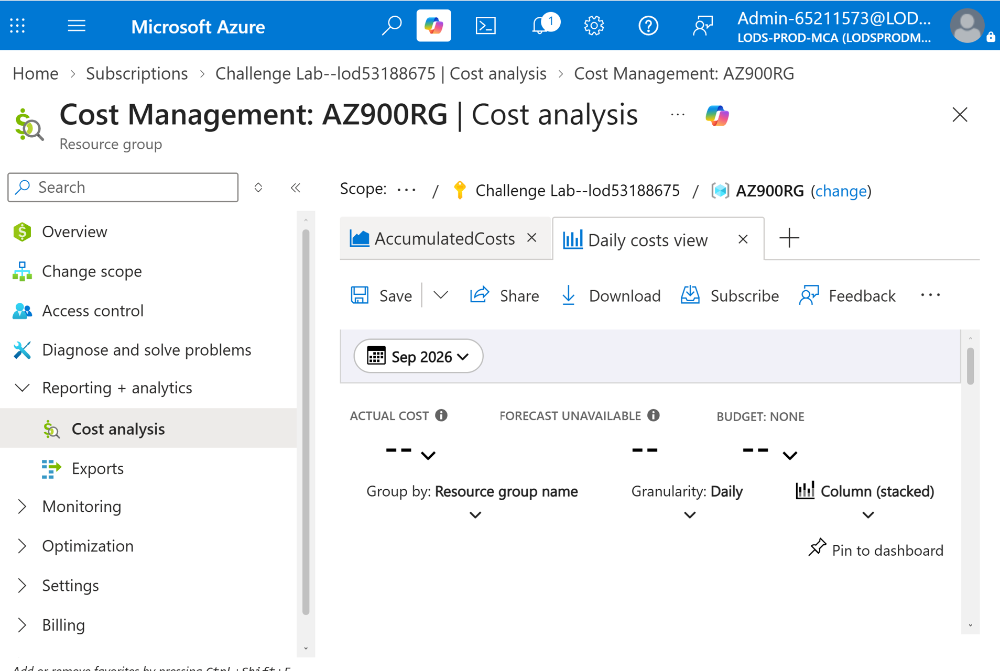
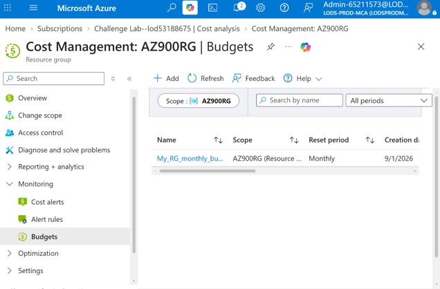

# Cloud Cost Governance with Azure Cost Management

## Project Overview

This component of the platform demonstrates the implementation of cost governance and financial monitoring practices within Microsoft Azure. The solution focused on reviewing subscription-level information, exploring Azure Cost Management capabilities, and establishing proactive budget monitoring through cost alerts.

Effective cost governance helps organizations maintain financial visibility, control cloud spending, and identify optimization opportunities before costs exceed planned budgets.

---

# Business Scenario

As cloud environments grow, organizations require mechanisms to monitor resource consumption and manage operational costs.

Cloud cost governance enables organizations to:

- Track cloud spending
- Monitor resource utilization
- Forecast future costs
- Establish spending thresholds
- Receive notifications when budgets are exceeded

To support these requirements, Azure Cost Management tools were evaluated and configured within the Azure environment.

---

# Objectives

- Review Azure subscription information
- Explore Azure Cost Management capabilities
- Analyze available cost monitoring tools
- Create a cost management budget
- Configure automated budget alerts
- Improve cloud financial visibility

---

# Solution Components

## Azure Subscription Management

The Azure subscription was reviewed to understand resource ownership, available services, and billing relationships.

### Purpose

- Review subscription details
- Understand billing ownership
- Validate available cloud services
- Identify cost allocation boundaries

### Benefits

- Improved administrative visibility
- Better understanding of billing structure
- Foundational governance awareness

---

## Azure Cost Management

Azure Cost Management was used to analyze consumption and available financial governance capabilities.

### Purpose

- Monitor cloud spending
- Review usage trends
- Analyze resource costs
- Support financial planning

### Benefits

- Increased spending visibility
- Cost optimization opportunities
- Improved budget planning
- Enhanced financial accountability

---

## Budget Monitoring and Alerts

A budget was created and linked to cost-based alert notifications.

### Purpose

- Establish spending thresholds
- Detect unexpected cost increases
- Notify administrators proactively
- Support financial governance

### Benefits

- Proactive cost control
- Reduced risk of overspending
- Improved budget compliance
- Enhanced operational awareness

---

# Implementation Workflow

The following workflow was completed:

1. Review Azure subscription information.
2. Examine subscription-level configuration details.
3. Explore Azure Cost Management features.
4. Review available cost reporting capabilities.
5. Create a budget for cloud spending.
6. Configure budget thresholds.
7. Create automated cost alerts.
8. Validate successful budget configuration.

---

# Azure Subscription Review

The Azure subscription was reviewed to understand billing and administrative information associated with the project environment.

### Activities Completed

- Reviewed subscription information
- Examined account ownership details
- Verified available Azure services
- Reviewed subscription configuration

### Outcome

Successfully gained visibility into the subscription environment and billing structure.

> Note: Screenshots were not captured during the subscription review process.

---

# Azure Cost Management Analysis

Azure Cost Management tools were reviewed to understand available monitoring and reporting capabilities.

### Activities Completed

- Explored cost analysis features
- Reviewed spending breakdown options
- Examined cost reporting capabilities
- Evaluated governance features

### Screenshot



*Figure 1. Azure Cost Management dashboard used to review cloud spending and governance capabilities.*

### Outcome

Successfully reviewed available tools for monitoring and managing cloud costs.

---

# Budget and Alert Configuration

A cost management budget was created to establish spending limits and trigger notifications when predefined thresholds were reached.

### Activities Completed

- Created budget configuration
- Defined spending threshold values
- Configured automated alerts
- Validated notification settings

### Screenshot



*Figure 2. Azure Cost Management budget and alert configuration.*

### Outcome

Successfully implemented proactive cost monitoring through budget tracking and automated alerting.

---

# Architecture

```text
Azure Subscription
        │
        ▼
Azure Cost Management
        │
        ├─────────────► Cost Analysis
        │
        ├─────────────► Cost Reporting
        │
        └─────────────► Budget Monitoring
                                │
                                ▼
                        Alert Notifications
                                │
                                ▼
                         Budget Governance
```

---

# Validation Results

### Validation Checklist

- [x] Azure subscription reviewed successfully
- [x] Subscription information validated
- [x] Azure Cost Management explored
- [x] Cost analysis features reviewed
- [x] Budget created successfully
- [x] Cost thresholds configured
- [x] Alert notifications configured
- [x] Budget monitoring validated

---

# Key Outcomes

- Reviewed Azure subscription and billing structure.
- Evaluated Azure Cost Management capabilities.
- Improved understanding of cloud cost governance practices.
- Implemented budget monitoring for cloud resources.
- Configured automated spending alerts.
- Established proactive financial management controls.

---

# Skills Demonstrated

- Microsoft Azure
- Azure Cost Management
- Cloud Governance
- Cost Optimization
- Budget Planning
- Financial Operations (FinOps)
- Azure Administration
- Cost Analysis
- Budget Monitoring
- Alert Configuration
- Cloud Financial Management
- Resource Governance
