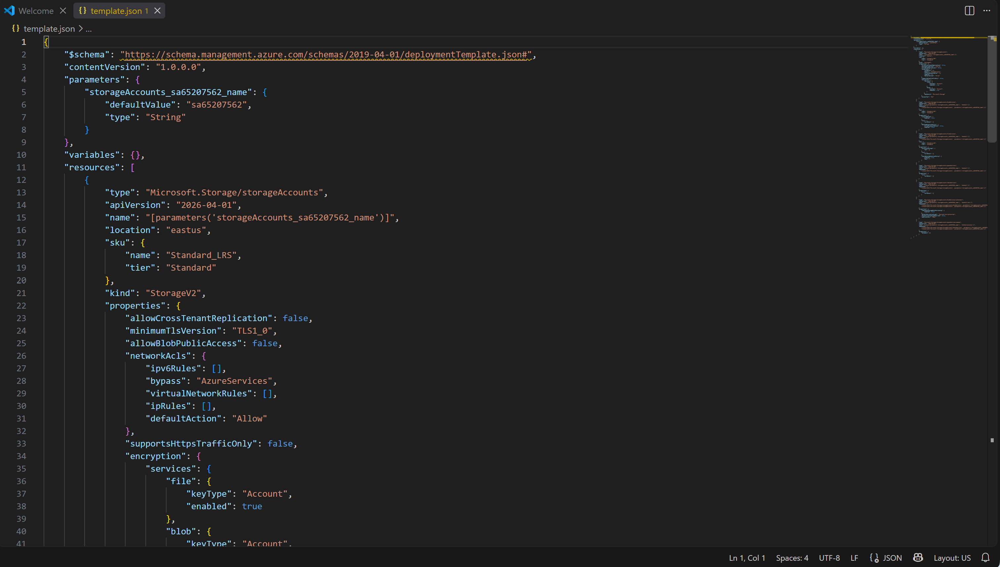
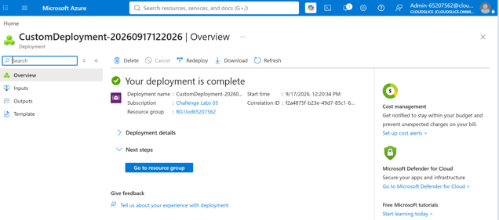
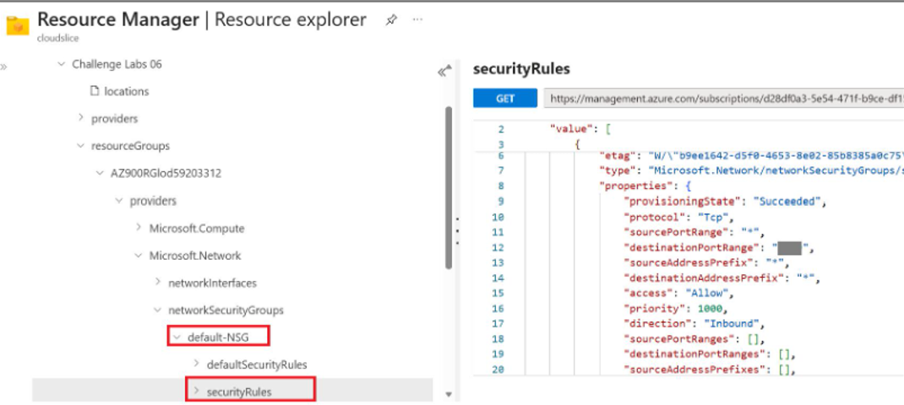

# Infrastructure as Code with Azure Resource Manager Templates

## Project Overview

This component of the platform demonstrates the implementation of Infrastructure as Code (IaC) practices using Azure Resource Manager (ARM) templates.

The solution focused on exporting existing Azure resource configurations, deploying infrastructure through reusable ARM templates, and examining the underlying Azure Resource Manager API structure using Azure Resource Explorer.

By leveraging declarative infrastructure definitions, cloud resources can be deployed consistently and repeatedly across different environments.

---

# Business Scenario

Modern cloud environments require a reliable and standardized deployment process to reduce manual configuration and improve operational consistency.

Infrastructure as Code enables organizations to:

- Automate resource provisioning
- Standardize deployments
- Improve change management
- Reduce configuration drift
- Increase deployment reliability

To support these objectives, ARM templates were used to define and deploy Azure resources programmatically.

---

# Objectives

- Export infrastructure configurations as reusable ARM templates
- Deploy cloud resources through Infrastructure as Code
- Validate template-based deployment workflows
- Examine Azure Resource Manager APIs
- Understand Azure resource definitions and metadata

---

# Solution Components

## Azure Resource Manager (ARM) Templates

ARM templates were used to define Azure resources using a declarative JSON format.

### Purpose

- Automate resource deployment
- Standardize infrastructure configuration
- Enable repeatable deployments

### Benefits

- Version-controlled infrastructure
- Consistent deployments
- Reduced manual configuration
- Improved scalability

---

## Virtual Machine Deployment

A virtual machine was deployed using a custom ARM template generated from an existing Azure resource.

### Purpose

- Validate Infrastructure as Code deployment processes
- Recreate infrastructure through template-based provisioning
- Demonstrate automated resource deployment

### Benefits

- Reproducible environments
- Increased deployment speed
- Improved configuration consistency

---

## Azure Resource Explorer

Azure Resource Explorer was used to examine the Azure Resource Manager API and underlying resource definitions.

### Purpose

- Explore Azure resource properties
- Analyze resource schemas
- Understand Azure REST API structures
- Review deployment metadata

### Benefits

- Deeper understanding of Azure resource management
- Improved troubleshooting capabilities
- Better infrastructure design decisions

---

# Implementation Workflow

The following workflow was completed:

1. Create and configure Azure resources.
2. Export resource configuration using Azure Portal.
3. Generate a custom ARM template.
4. Review template structure and parameters.
5. Deploy a virtual machine using the ARM template.
6. Validate successful resource deployment.
7. Explore resource definitions using Azure Resource Explorer.
8. Examine Azure Resource Manager API properties and metadata.

---

# ARM Template Export

An existing Azure resource configuration was exported directly from Azure Portal.

### Activities Completed

- Generated ARM template from deployed resources
- Reviewed resource definitions
- Examined deployment parameters
- Analyzed template structure

### Screenshot



*Figure 1. ARM template exported from Azure Portal.*

---

# ARM-Based Virtual Machine Deployment

The exported template was used to deploy a new virtual machine using Infrastructure as Code principles.

### Activities Completed

- Validated ARM template configuration
- Executed template deployment
- Provisioned virtual machine resources
- Confirmed successful deployment

### Screenshot



*Figure 2. Virtual machine deployed using a custom ARM template.*

---

# Azure Resource Explorer Analysis

Azure Resource Explorer was used to inspect Azure Resource Manager APIs and resource definitions.

### Activities Completed

- Navigated Azure resource hierarchy
- Reviewed resource metadata
- Examined deployment properties
- Explored Azure API structures

### Screenshot



*Figure 3. Azure Resource Explorer displaying resource definitions and API information.*

---

# Architecture

```text
Azure Portal
      │
      ▼
Export ARM Template
      │
      ▼
ARM Template (JSON)
      │
      ▼
Azure Resource Manager
      │
      ▼
Virtual Machine Deployment
      │
      ▼
Azure Resources

Azure Resource Explorer
      │
      ▼
Azure Resource Manager API
```

---

# Validation Results

The deployment was validated through the successful provisioning of infrastructure resources.

### Validation Checklist

- [x] Resource configuration exported successfully
- [x] ARM template generated successfully
- [x] Template structure reviewed
- [x] Virtual machine deployed successfully
- [x] Deployment completed without errors
- [x] Azure Resource Explorer accessed successfully
- [x] Resource metadata examined
- [x] Azure API structure analyzed

---

# Key Outcomes

- Successfully implemented Infrastructure as Code practices.
- Exported reusable ARM templates from Azure resources.
- Automated virtual machine deployment through declarative templates.
- Reduced reliance on manual infrastructure configuration.
- Examined Azure Resource Manager APIs and resource metadata.
- Improved understanding of Azure deployment architecture.

---

# Skills Demonstrated

- Microsoft Azure
- Infrastructure as Code (IaC)
- Azure Resource Manager (ARM)
- ARM Templates
- Virtual Machine Deployment
- Automated Provisioning
- Azure Resource Explorer
- Azure Resource Manager API
- Cloud Infrastructure
- Deployment Automation
- Azure Administration
- Cloud Architecture
