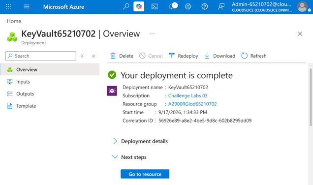
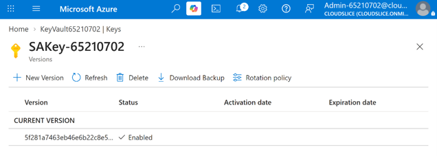

# Secrets and Encryption Management with Azure Key Vault

## Project Overview

This component of the platform demonstrates the implementation of encryption and secrets management using Azure Key Vault. The solution focused on securely storing encryption keys, creating a customer-managed key (CMK), and configuring Azure Storage encryption to use the customer-managed key.

By centralizing key management and controlling encryption ownership, organizations can improve data protection, strengthen compliance controls, and maintain greater visibility over encryption assets.

---

# Business Scenario

Organizations storing sensitive data in the cloud often require tighter control over encryption keys than the default platform-managed approach.

Customer-managed encryption keys allow organizations to:

- Control key ownership
- Manage key lifecycle operations
- Meet regulatory requirements
- Enhance security visibility
- Strengthen data protection strategies

To address these requirements, Azure Key Vault was implemented as the centralized encryption management solution.

---

# Objectives

- Create and configure Azure Key Vault
- Establish centralized key management
- Create a customer-managed encryption key
- Configure storage encryption using a customer-managed key
- Improve protection of cloud data resources

---

# Solution Components

## Azure Key Vault

Azure Key Vault was deployed as the centralized repository for encryption keys and security assets.

### Purpose

- Securely store encryption keys
- Centralize key management
- Control access to cryptographic assets
- Support encryption operations

### Benefits

- Enhanced security
- Controlled access to keys
- Simplified key management
- Improved compliance support

---

## Customer-Managed Encryption Key (CMK)

A customer-managed encryption key was created within Azure Key Vault.

### Purpose

- Provide ownership of encryption keys
- Enable organization-controlled encryption
- Support advanced security requirements

### Benefits

- Increased control over encryption
- Key rotation capabilities
- Improved governance
- Enhanced security transparency

---

## Azure Storage Encryption

Azure Storage encryption was configured to use the customer-managed key stored in Azure Key Vault.

### Purpose

- Protect stored data
- Integrate storage encryption with Key Vault
- Support organization-controlled encryption policies

### Benefits

- Improved data security
- Centralized encryption management
- Stronger compliance alignment

---

# Implementation Workflow

The following workflow was completed:

1. Create an Azure Key Vault.
2. Configure Key Vault settings and access controls.
3. Create a customer-managed encryption key.
4. Verify key creation and configuration.
5. Create or identify an Azure Storage Account.
6. Associate the customer-managed key with the Storage Account.
7. Enable storage encryption using the customer-managed key.
8. Validate successful encryption configuration.

---

# Azure Key Vault Configuration

Azure Key Vault was created and configured to serve as the centralized encryption management service.

### Activities Completed

- Created Azure Key Vault
- Configured vault settings
- Verified access permissions
- Prepared key management environment

### Screenshot



*Figure 1. Azure Key Vault successfully created and configured.*

### Outcome

Successfully established a centralized service for encryption key management.

---

# Customer-Managed Encryption Key Creation

A customer-managed encryption key was created within Azure Key Vault to support organization-controlled encryption.

### Activities Completed

- Created encryption key
- Configured cryptographic settings
- Verified key availability
- Prepared key for storage integration

### Outcome

Successfully created a customer-managed key for use with Azure Storage encryption.

> Note: Screenshots were not captured during the customer-managed key creation process.

---

# Storage Account Encryption Configuration

An Azure Storage Account was configured to use the customer-managed encryption key stored within Azure Key Vault.

### Activities Completed

- Selected target Storage Account
- Connected Key Vault encryption key
- Configured customer-managed encryption
- Verified encryption settings

### Screenshot



*Figure 2. Azure Storage Account configured to use a customer-managed encryption key.*

### Outcome

Successfully configured Azure Storage encryption using a customer-managed key managed through Azure Key Vault.

---

# Architecture

```text
Azure Key Vault
        │
        ▼
Customer-Managed Key (CMK)
        │
        ▼
Azure Storage Account
        │
        ▼
Encrypted Data

Access Management
        │
        ▼
Key Vault Permissions
```

---

# Validation Results

### Validation Checklist

- [x] Azure Key Vault created successfully
- [x] Key Vault configuration verified
- [x] Customer-managed encryption key created
- [x] Encryption key available for use
- [x] Storage Account connected to Key Vault
- [x] Customer-managed encryption enabled
- [x] Encryption configuration validated

---

# Key Outcomes

- Successfully deployed and configured Azure Key Vault.
- Implemented centralized encryption key management.
- Created a customer-managed encryption key.
- Configured Azure Storage to use customer-managed encryption.
- Enhanced protection of cloud-stored data.
- Demonstrated encryption governance and key ownership practices.

---

# Skills Demonstrated

- Microsoft Azure
- Azure Key Vault
- Data Encryption
- Customer-Managed Keys (CMK)
- Encryption Key Management
- Azure Storage Accounts
- Cloud Security
- Secrets Management
- Data Protection
- Security Governance
- Azure Administration
- Storage Security
