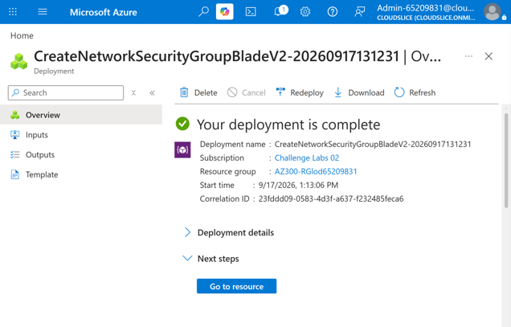
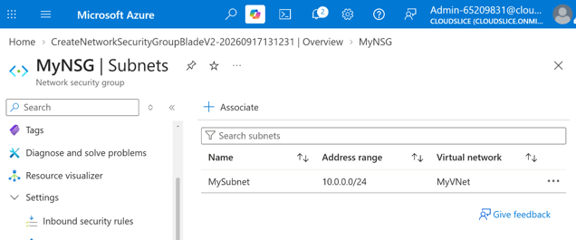
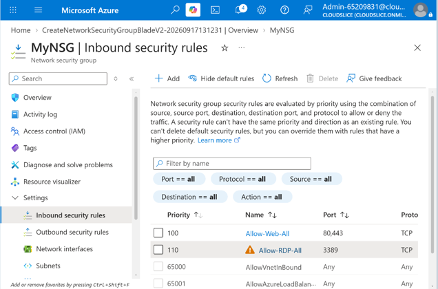

# Network Security Controls with Azure Network Security Groups

## Project Overview

This component of the platform demonstrates the implementation of network security controls using Azure Network Security Groups (NSGs). The solution focused on establishing traffic filtering policies, associating security controls with network infrastructure, and enforcing access restrictions through custom security rules.

By implementing network-level access controls, cloud resources can be protected from unauthorized communication while maintaining required connectivity.

---

# Business Scenario

Cloud environments require security controls that regulate inbound and outbound network traffic. Without proper network segmentation and access management, resources may be exposed to unnecessary security risks.

Network Security Groups provide a mechanism for enforcing security policies that:

- Restrict unauthorized access
- Control network communication
- Protect cloud workloads
- Support security best practices
- Enable least-privilege access

To address these requirements, an NSG was deployed and configured to protect Azure network resources.

---

# Objectives

- Create an Azure Network Security Group
- Associate security controls with a subnet
- Define custom network security rules
- Restrict and manage network traffic
- Demonstrate network security best practices

---

# Solution Components

## Network Security Group (NSG)

An Azure Network Security Group was created to manage and filter network traffic between Azure resources.

### Purpose

- Control inbound traffic
- Control outbound traffic
- Protect network resources
- Enforce security policies

### Benefits

- Centralized network security management
- Improved security posture
- Traffic filtering and monitoring
- Reduced exposure to unauthorized access

---

## Subnet Association

The Network Security Group was associated with a subnet to enforce traffic rules across all resources connected to that network segment.

### Purpose

- Apply security rules consistently
- Protect multiple resources simultaneously
- Simplify security administration

### Benefits

- Scalable security management
- Consistent policy enforcement
- Improved network segmentation

---

## Security Rules

Custom security rules were created to define permitted and restricted network traffic.

### Purpose

- Manage inbound access
- Control outbound communication
- Enforce least-privilege principles
- Restrict unnecessary connectivity

### Benefits

- Enhanced security
- Reduced attack surface
- Controlled resource access

---

# Implementation Workflow

The following workflow was completed:

1. Create a Network Security Group.
2. Review default security rules.
3. Associate the NSG with an Azure subnet.
4. Create custom inbound security rules.
5. Create custom outbound security rules.
6. Apply traffic filtering policies.
7. Validate successful rule configuration.
8. Confirm subnet-level protection.

---

# Network Security Group Creation

An Azure Network Security Group was deployed to serve as the primary network access control mechanism.

### Activities Completed

- Created Network Security Group
- Reviewed default security settings
- Prepared security control policies

### Screenshot



*Figure 1. Azure Network Security Group successfully created.*

### Outcome

Successfully deployed a network security control capable of filtering inbound and outbound traffic.

---

# NSG Association with Subnet

The newly created Security Group was associated with a subnet to apply network protection across connected resources.

### Activities Completed

- Identified target subnet
- Linked Network Security Group to subnet
- Applied network-level protection
- Confirmed successful association

### Screenshot



*Figure 2. Network Security Group associated with an Azure subnet.*

### Outcome

Security policies were successfully enforced across resources within the subnet.

---

# Security Rule Configuration

Custom security rules were configured to control network communication.

### Activities Completed

- Created traffic filtering rules
- Configured rule priorities
- Defined permitted traffic patterns
- Restricted unnecessary network access
- Reviewed rule effectiveness

### Screenshot



*Figure 3. Custom Network Security Group rules configured to control network traffic.*

### Outcome

Traffic filtering policies were successfully implemented according to project requirements.

---

# Architecture

```text
Internet
    │
    ▼
Network Security Group
    │
    ▼
Azure Subnet
    │
    ▼
Azure Resources

Security Rules
    │
    ├── Allow Approved Traffic
    └── Deny Unauthorized Traffic
```

---

# Validation Results

### Validation Checklist

- [x] Network Security Group created successfully
- [x] Security Group associated with subnet
- [x] Custom security rules configured
- [x] Rule priorities validated
- [x] Access restrictions applied
- [x] Traffic filtering operational
- [x] Network protection confirmed

---

# Key Outcomes

- Successfully deployed Azure Network Security Groups.
- Applied security controls at the subnet level.
- Implemented custom traffic filtering policies.
- Enforced network access restrictions.
- Demonstrated least-privilege network design principles.
- Improved overall cloud security posture.

---

# Skills Demonstrated

- Microsoft Azure
- Azure Networking
- Network Security Groups (NSGs)
- Cloud Security
- Network Segmentation
- Access Control
- Security Rule Management
- Infrastructure Security
- Traffic Filtering
- Azure Administration
- Security Architecture
- Cloud Infrastructure
