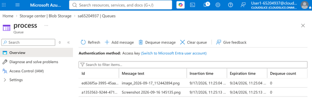
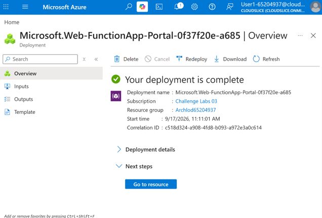

# Event-Driven Processing Solution with Azure Functions and Queue Storage

## Project Overview

This component of the platform demonstrates the implementation of an event-driven serverless workload using Azure Functions and Azure Queue Storage.

The solution was designed to process messages asynchronously through a queue-based architecture, allowing workloads to scale automatically while reducing infrastructure management requirements.

---

# Business Scenario

Many cloud applications require background processing capabilities for tasks that do not need immediate execution.

Examples include:

- Order processing
- Notification delivery
- Data synchronization
- Report generation

To support these scenarios, an event-driven architecture was implemented using Azure Functions and Azure Queue Storage.

---

# Objectives

- Deploy a serverless compute service
- Configure queue-based message processing
- Implement asynchronous workload handling
- Validate event processing through testing
- Demonstrate scalable cloud-native design patterns

---

# Solution Components

## Azure Function App

An Azure Function App was deployed to host the serverless workload.

### Purpose

- Execute code on demand
- Automatically scale based on workload
- Eliminate server management overhead

### Benefits

- Consumption-based pricing
- Automatic scaling
- Reduced operational complexity

---

## Azure Queue Storage

Azure Queue Storage was configured to act as the messaging layer between services.

### Purpose

- Store messages awaiting processing
- Decouple application components
- Improve workload reliability

### Benefits

- Asynchronous processing
- Improved fault tolerance
- Increased scalability

---

## Output Binding Configuration

Output bindings were configured within the Azure Function to simplify interaction with Azure storage services.

### Purpose

Output bindings automatically connect function execution results to external Azure services without requiring additional connection logic.

### Benefits

- Reduced application code
- Simplified integrations
- Faster development

---

# Implementation Workflow

The following workflow was established:

1. Create Azure Queue Storage.
2. Deploy Azure Function App.
3. Configure queue trigger functionality.
4. Configure output bindings.
5. Submit test messages to the queue.
6. Process messages through Azure Functions.
7. Validate successful execution.

---

# Testing and Validation

## Queue Message Processing

Test messages were successfully added to Azure Queue Storage.

The Function App automatically detected incoming queue messages and triggered execution.

### Screenshot



*Figure 1. Queue messages processed by Azure Functions.*

---

## Function App Validation

The Azure Function was tested to verify successful execution and response handling.

### Validation Results

- Function App deployed successfully
- Queue trigger activated successfully
- Output binding configured successfully
- Messages processed successfully
- Execution completed without errors

### Screenshot



*Figure 2. Azure Function App deployment.*

---

# Architecture

```text
Application
     │
     ▼
Azure Queue Storage
     │
     ▼
Azure Function App
     │
     ▼
Output Binding
     │
     ▼
Azure Service
```

---

# Key Outcomes

- Successfully deployed a serverless compute solution.
- Implemented asynchronous message processing.
- Configured Azure Queue Storage integration.
- Tested queue-triggered execution workflows.
- Validated output binding functionality.
- Demonstrated event-driven architecture principles.

---

# Skills Demonstrated

- Microsoft Azure
- Azure Functions
- Azure Queue Storage
- Event-Driven Architecture
- Serverless Computing
- Cloud Application Integration
- Asynchronous Processing
- Azure Storage Services
- Application Testing and Validation
